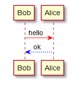

# Markdown PDF

Easy to use tool to convert a markdown file to a PDF.


## Features

Supports the following features
* Supports export from MD to PDF, HTML, PNG and JPEG
* [Syntax highlighting](https://highlightjs.org/static/demo/)
* [markdown-it-checkbox](https://github.com/mcecot/markdown-it-checkbox)
* [markdown-it-container](https://github.com/markdown-it/markdown-it-container)
* [PlantUML](http://plantuml.com/)
  * [markdown-it-plantuml](https://github.com/gmunguia/markdown-it-plantuml)

* [Sample pdf file](sample/README.pdf)

### markdown-it-container

INPUT
```
::: warning
*here be dragons*
:::
```

OUTPUT
``` html
<div class="warning">
<p><em>here be dragons</em></p>
</div>
```

### markdown-it-plantuml

INPUT
```
@startuml
Bob -[#red]> Alice : hello
Alice -[#0000FF]->Bob : ok
@enduml
```

OUTPUT



### Syntax highlight options

<a id="pretty-pdf-highlight"/>

#### `highlight`
  - Enable Syntax highlighting
  - boolean. Default: true

<a id="pretty-pdf-highlightStyle"/>

#### `highlightStyle`
  - Set the style name, this is a builtin Highlight JS css file without the file extension. For example: `github`, `monokai`... Default: `github`
  - [style list](https://github.com/isagalaev/highlight.js/tree/master/src/styles)
  - demo site : https://highlightjs.org/static/demo/
